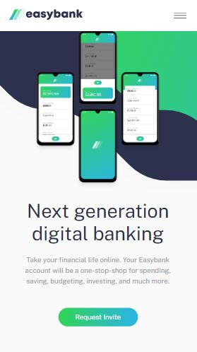
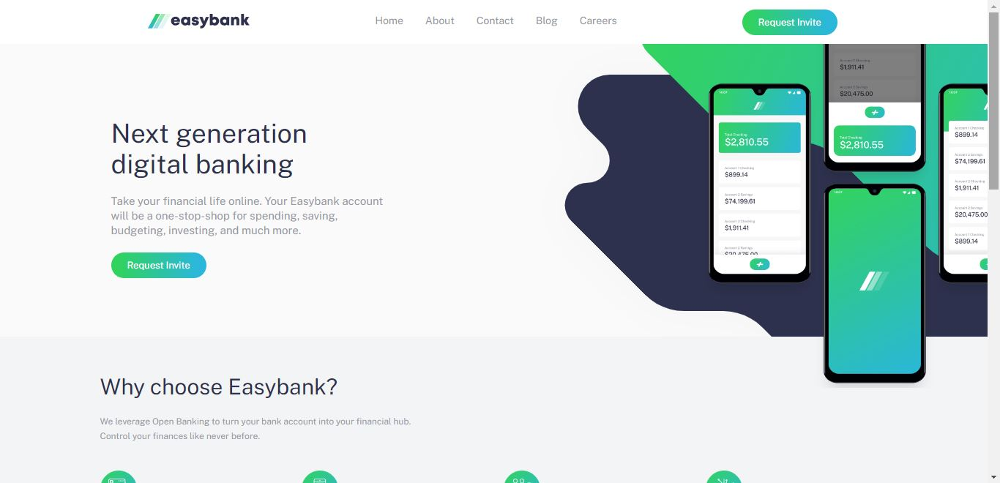

# Easybank-landing-page

Solution to Frontend Mentor Challenge "Easybank landing page"

This is a solution to the [Easybank landing page challenge on Frontend Mentor](https://www.frontendmentor.io/challenges/easybank-landing-page-WaUhkoDN/hub/easybank-landing-page-YcPg0dRM7I). Frontend Mentor challenges help you improve your coding skills by building realistic projects.

## Table of contents

- [Overview](#overview)
  - [The challenge](#the-challenge)
  - [Screenshot](#screenshot)
  - [Links](#links)
  - [Run project](#run-project)
- [My process](#my-process)
  - [Built with](#built-with)
  - [What I learned](#what-i-learned)
  - [Continued development](#continued-development)
- [Author](#author)

## Overview

This is my solution to the Frontend Mentor challenge "Easybank landing page", I coded it using HTML, SASS, the pattern design "mobile first", JavaScript and Webpack.

### The challenge

Users should be able to:

- View the optimal layout depending on their device's screen size
- See hover states for interactive elements

### Screenshot

## Mobile

## Desktop

### Links

- Solution URL: [solution URL here](https://www.frontendmentor.io/solutions/easybak-landing-page-solution-using-html-sass-and-javascript-8Iaio5PzE6)
- Live Site URL: [live site URL here](https://diegohrp.github.io/Easybank-landing-page/21)

### Run project

npm install
npm run dev

## My process

### Built with

- Semantic HTML5 markup
- SASS
- Flexbox
- CSS Grid
- Mobile-first workflow
- JavaScript

### What I learned

I learned intermediate HTML and CSS layout and how to create responsive web sites.

### Continued development

I'm planning to focus on web development using React.js and styled components with the best practices, besides, introduce myself into backend with node.js and express to develop more advanced and complex projects.
I also have the goal to get a job as a full stack developer.

## Author

- Website - [Diego Herrera Prado](https://my-portfolio-diegohrp.vercel.app/)
- Frontend Mentor - [Diegohrp](https://www.frontendmentor.io/profile/Diegohrp)
- Twitter - [@diego_hpr](https://twitter.com/diego_hpr)
